# TP1 — Premiers pas en Deep Learning

## 1. Utilisation de SLURM

### GPU alloué

Après connexion au nœud de calcul via `srun`, on exécute `nvidia-smi` :

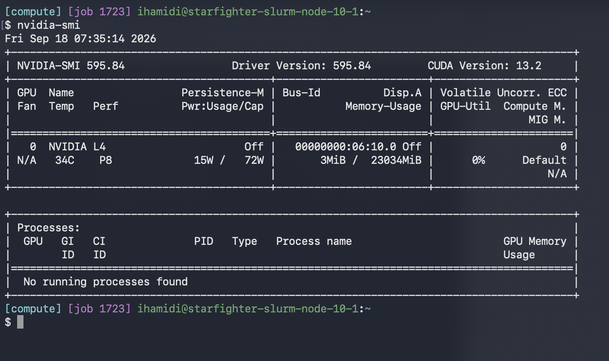

Le GPU alloué est un **NVIDIA L4** avec 23 034 MiB de VRAM (Driver 595.84, CUDA 13.2).

### Annulation d'un job

On liste les jobs avec `squeue -u $USER` pour récupérer le JobID, puis on annule :

```bash
scancel 1723
```

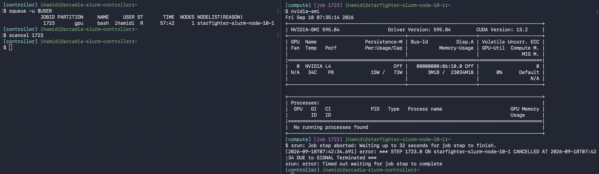

### Script sbatch

Le script [hello.sh](hello.sh) soumis avec `sbatch hello.sh` (Job 1763).

Le fichier de log généré : `logs/hello-slurm-1763.out`

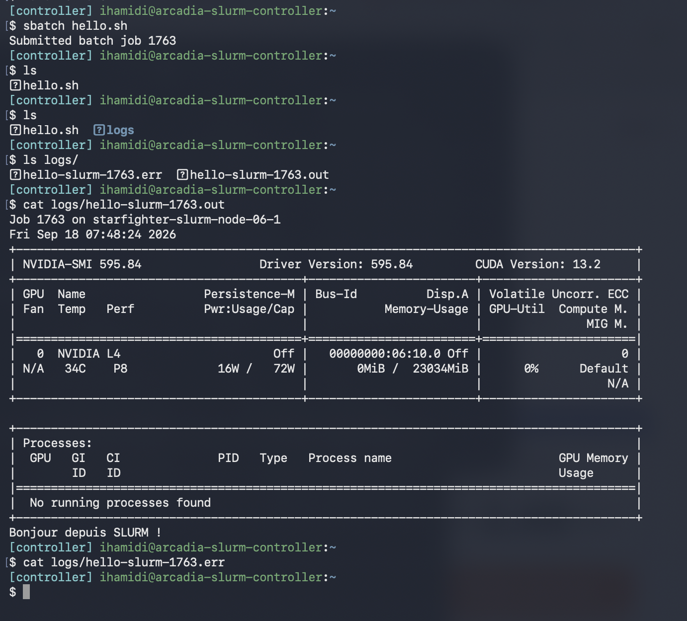

### Analyse avec sacct

```bash
sacct -j 1763 --format=JobID,State,Elapsed,MaxRSS,ReqMem,ReqCPUS
```

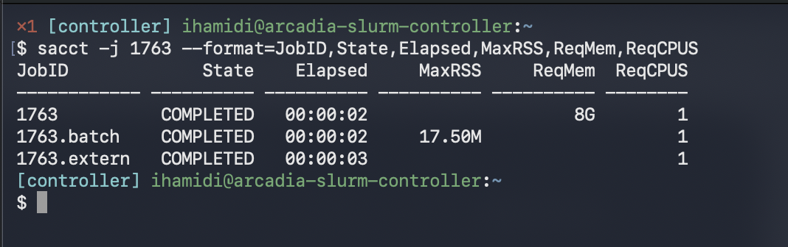

- **ReqMem** : la mémoire qu'on a demandée lors de la soumission (ici 8G). C'est une réservation.
- **MaxRSS** : la mémoire réellement utilisée au pic d'exécution (ici 17.5M). Le job n'a donc consommé qu'une infime fraction de ce qui était réservé.

---

## 2. Environnement virtuel Python

### Version de Python

Pour vérifier la version exacte et le chemin du binaire dans l'environnement actif :

```bash
python --version && which python
```

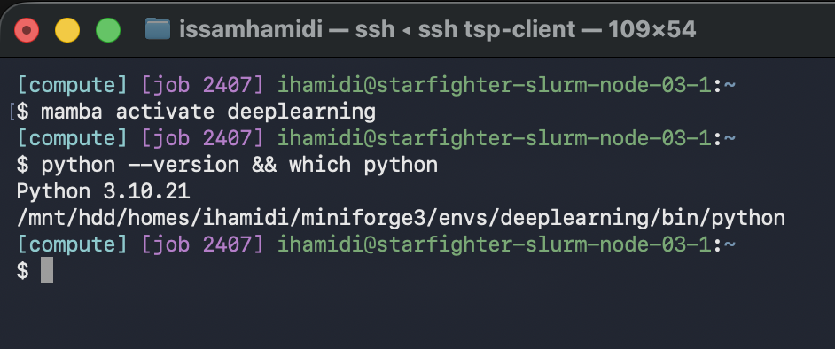

- Version : Python 3.10.21
- Chemin : `/mnt/hdd/homes/ihamidi/miniforge3/envs/deeplearning/bin/python`

Le binaire pointe bien vers l'env `deeplearning`, c'est bon.

### Vérification PyTorch + CUDA

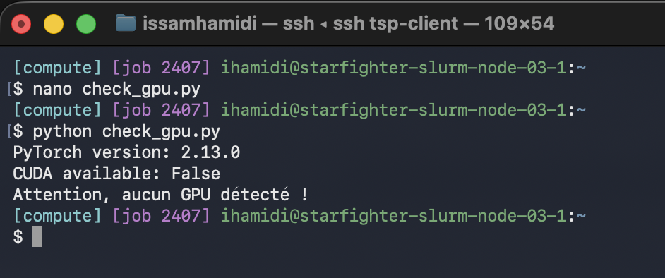

```
PyTorch version: 2.13.0
CUDA available: False
Attention, aucun GPU détecté !
```

CUDA n'est pas détecté. Deux raisons possibles :

1. PyTorch a été installé avec `pytorch-cuda=12.1` mais le driver du cluster supporte CUDA 13.2 — incompatibilité de versions.
2. Mamba a pu installer la variante CPU-only si les canaux n'étaient pas dans le bon ordre.

### Environnement reproductible

```bash
mamba env export --from-history -n deeplearning > environment.yml
```

Le fichier [environment.yml](environment.yml) est versionné dans le dépôt.

### Version de TensorBoard

```bash
tensorboard --version
```

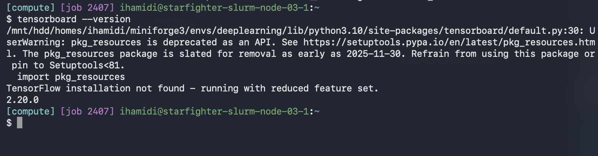

Version installée : 2.20.0

---

## 3. Exercices théoriques

### Architecture et paramètres

MLP avec 3 neurones en entrée, 4 en couche cachée, 2 en sortie :

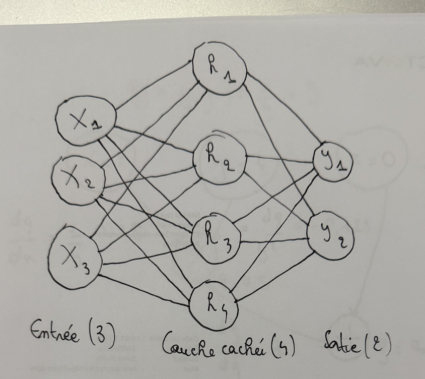

Nombre de paramètres :

- Sans biais : Couche 1 = 3×4 = 12, Couche 2 = 4×2 = 8 → **total 20**
- Avec biais : Couche 1 = 3×4 + 4 = 16, Couche 2 = 4×2 + 2 = 10 → **total 26**

### Équations et dimensions du forward pass

$$H = \text{ReLU}(X \cdot W_1^T + b_1)$$
$$Y = H \cdot W_2^T + b_2$$

```
X  : (N, 3)
W1 : (4, 3)
b1 : (1, 4) -> diffusé en (N, 4)
H  : (N, 4)
W2 : (2, 4)
b2 : (1, 2) -> diffusé en (N, 2)
Y  : (N, 2)
```

### Graphe de calcul et rétropropagation

$f(x, y, z) = x / y + z$, avec $q = x / y$.

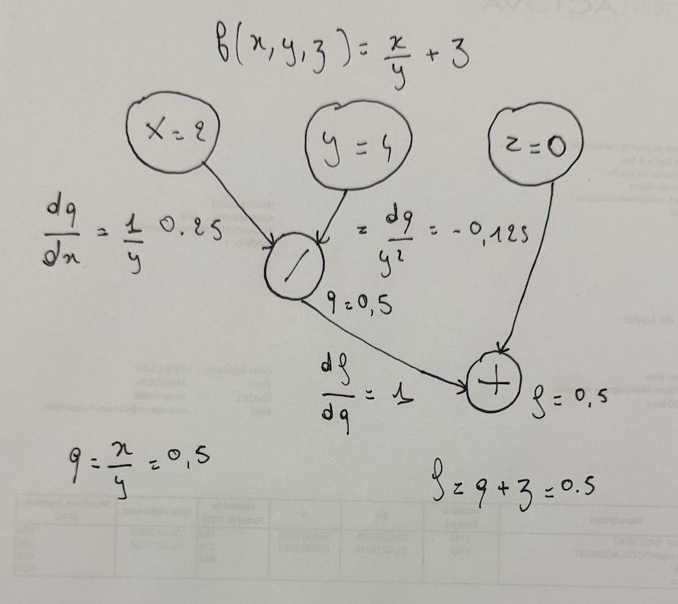

**Forward pass** avec $x=2, y=4, z=0$ :

$$q = \frac{2}{4} = 0.5 \quad f = 0.5 + 0 = 0.5$$

**Backpropagation :**

- $\frac{\partial f}{\partial q} = 1$, $\frac{\partial f}{\partial z} = 1$
- $\frac{\partial q}{\partial x} = \frac{1}{y} = 0.25$, $\frac{\partial q}{\partial y} = -\frac{x}{y^2} = -0.125$

Par la règle de la chaîne :

$$\frac{\partial f}{\partial x} = 0.25 \quad \frac{\partial f}{\partial y} = -0.125 \quad \frac{\partial f}{\partial z} = 1$$

### Mise à jour des poids (η = 1)

$$x' = 2 - 0.25 = 1.75 \quad y' = 4 + 0.125 = 4.125 \quad z' = 0 - 1 = -1$$

$$f' = \frac{1.75}{4.125} - 1 \approx -0.576$$

La valeur est bien passée de 0.5 à -0.576, la descente de gradient a fonctionné.

### Questions de réflexion

**Pourquoi la règle de la chaîne ?**
Un réseau profond est une composition de fonctions imbriquées. On ne peut pas calculer directement le gradient de la loss par rapport à un poids d'une couche profonde sans passer par toutes les couches intermédiaires. La règle de la chaîne permet de faire ça en décomposant le calcul de couche en couche.

**Pourquoi les mini-batchs ?**
Utiliser un seul exemple à la fois donne un gradient très bruité et l'entraînement devient instable. Utiliser tout le dataset d'un coup est souvent impossible en mémoire et lent. Un mini-batch (ex: 32 exemples) est un bon compromis : gradient plus stable qu'un exemple seul, et bien plus rapide qu'un full-batch.

### Association sortie / perte

| Tâche | Fonction de sortie | Fonction de perte |
|---|---|---|
| Classification binaire | Sigmoïde | BCE (Binary Cross-Entropy) |
| Classification multi-classes | Softmax | Cross-Entropy |
| Régression | Identité (aucune) | MSE |

---

## 4. Premier réseau de neurones

Le script complet est dans [train.py](train.py).

### Préparation des données

`batch_size` détermine combien d'images sont traitées ensemble avant chaque mise à jour des poids. `shuffle=True` à l'entraînement pour que le modèle ne mémorise pas l'ordre des exemples — `shuffle=False` au test car l'ordre n'a pas d'importance et on veut des résultats reproductibles.

### Implémentation du réseau

L'entrée est une image 32×32×3, soit 3072 valeurs une fois aplatie. `torch.flatten(x, 1)` fait cette mise à plat en gardant la dimension batch. On utilise `nn.Linear(3072, 128)` puis `nn.Linear(128, 10)` pour les 10 classes CIFAR-10.

On ne met pas de Softmax en sortie car `nn.CrossEntropyLoss` l'intègre déjà en interne (LogSoftmax + NLLLoss). Si on l'ajoutait, on l'appliquerait deux fois et la loss serait fausse.

### Entraînement

`optimizer.zero_grad()` remet les gradients à zéro avant chaque batch — sans ça ils s'accumulent. `loss.backward()` calcule les gradients par rétropropagation.

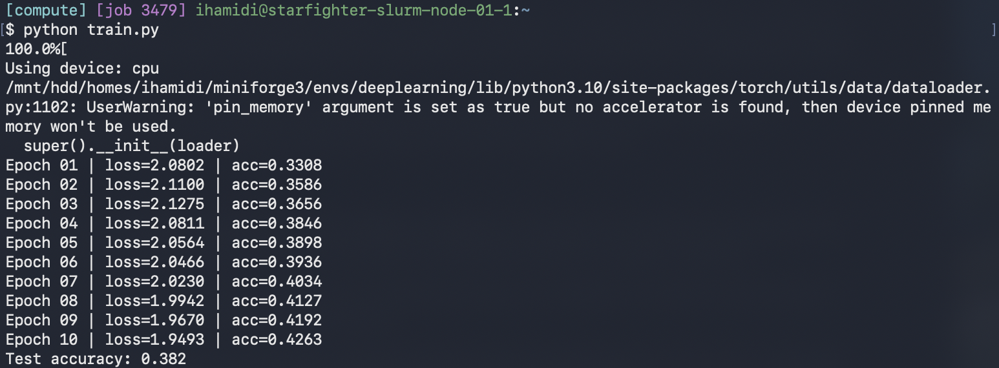

L'entraînement tourne sur CPU (CUDA non disponible). La loss descend de 2.08 à 1.95 et l'accuracy monte à ~43% sur le train en 10 époques.

### Évaluation

`torch.no_grad()` désactive le calcul des gradients pendant l'éval — pas besoin de les stocker, ça économise de la mémoire et accélère l'inférence.

Sur CIFAR-10 avec 10 classes équilibrées, un classifieur aléatoire ferait ~10%. On obtient **38.2%**, ce qui montre que le modèle a bien appris quelque chose malgré sa simplicité.

---

## 5. Utilisation de TensorBoard

Le script complet est dans [train_tb.py](train_tb.py).

### Split et hyperparamètres

On inclut la date, l'heure et les hyperparamètres dans le nom du dossier de logs pour pouvoir identifier chaque run dans TensorBoard. Sans ça, les runs avec les mêmes hparams s'écraseront ou se mélangeront.

### Visualisation

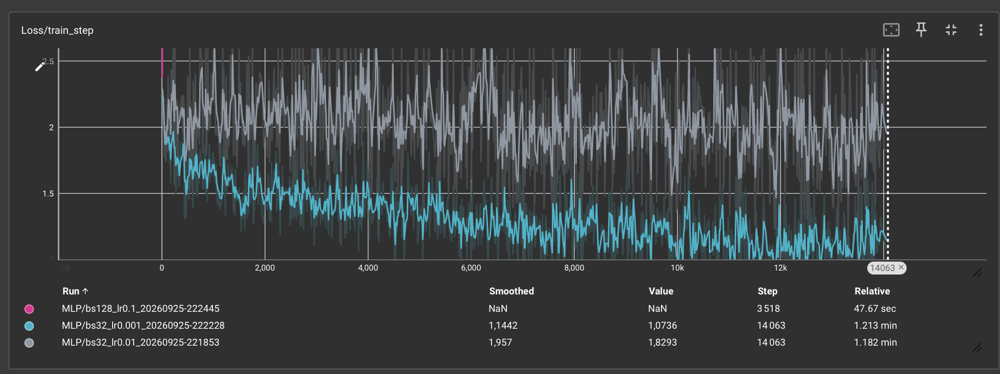

La courbe `Loss/train_step` est très bruitée parce qu'elle est calculée sur un seul batch de 32 images. `Loss/train` est une moyenne sur toute l'époque — elle est donc bien plus lisse. Un smoothing autour de 0.6 permet de voir la tendance de `train_step` sans trop l'écraser.

### Mini-sweep d'hyperparamètres

| Run | LR | batch_size | val_acc max | test_acc | Remarque |
|---|---|---|---|---|---|
| 1 | 1e-2 | 32 | 40.4% | 37.2% | Convergence lente, val_loss instable |
| 2 | 1e-3 | 32 | 50.7% | 50.6% | Meilleur run |
| 3 | 1e-1 | 128 | 9.6% | 10.0% | Loss = NaN, LR trop élevé |

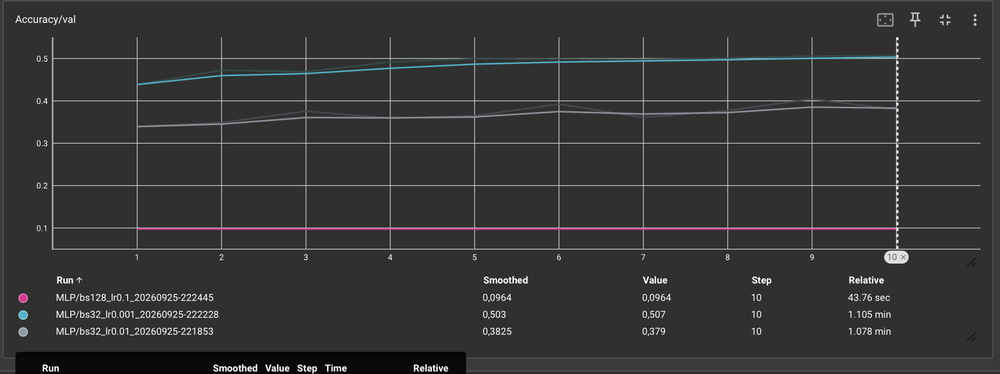

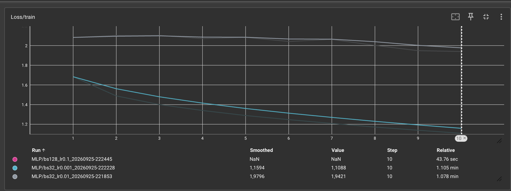

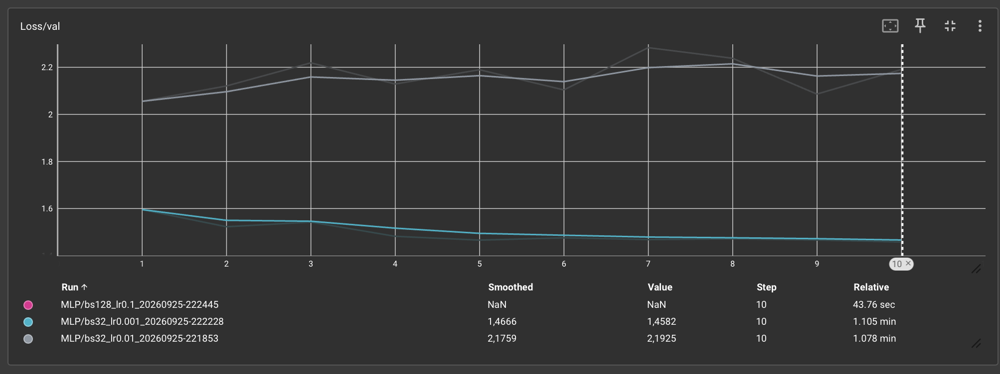

Le run 2 (LR=1e-3) est le meilleur. Le run 3 diverge complètement dès le départ : LR=0.1 est trop grand, les gradients explosent et la loss devient NaN.

**Détecter l'overfitting sur les courbes :** la loss d'entraînement continue de baisser pendant que la loss de validation remonte (ou stagne). L'écart entre les deux courbes se creuse — le modèle mémorise les données train au lieu de généraliser.
